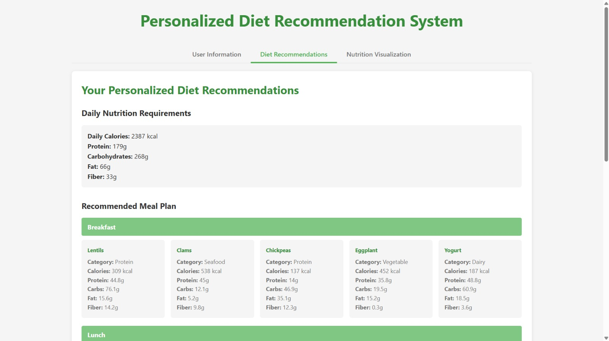
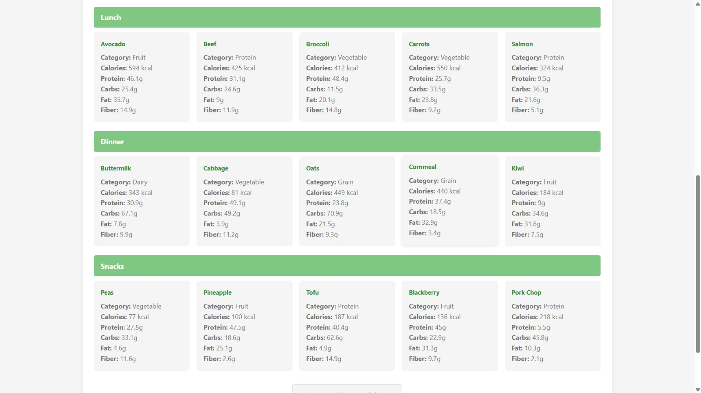
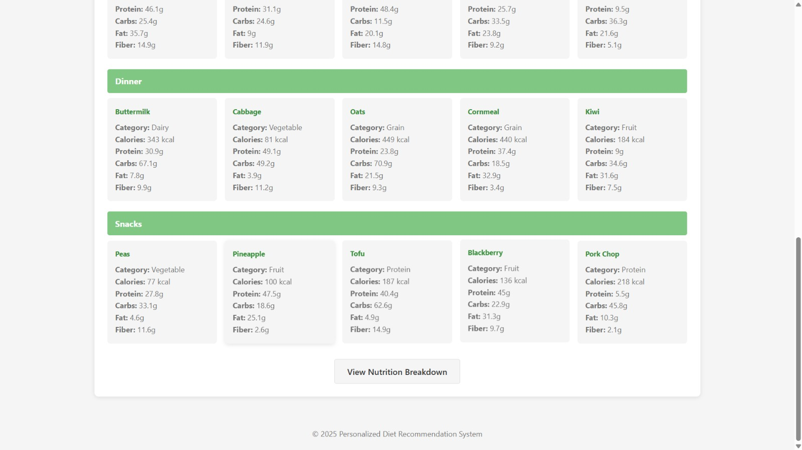
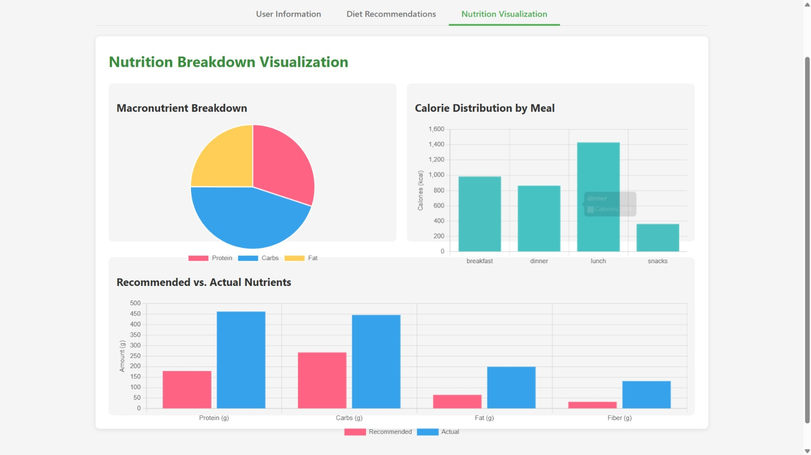
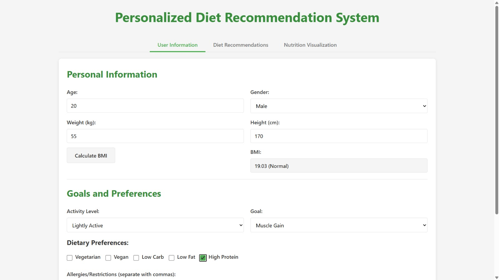
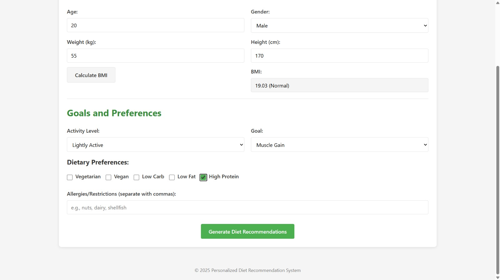
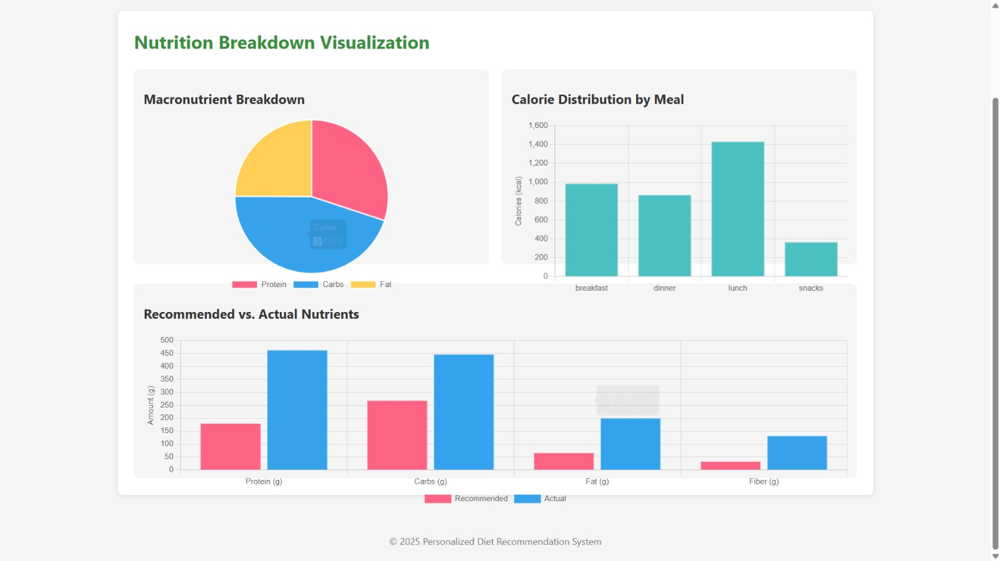

<div align="center">
  <h1>Personalized_Diet_Recommendation_System</h1>
  <p><em>Personalized nutrition planning powered by smart algorithms.</em></p>
  
  [](https://www.python.org/downloads/)
  [](https://flask.palletsprojects.com/)
  [](https://opensource.org/licenses/MIT)
  [](https://pandas.pydata.org/)
</div>

---

## ✨ Features

- **🧮 BMI Calculation**: Instantly analyze your body mass index
- **🍽️ Smart Meal Planning**: Generate customized meal plans based on your goals
- **📊 Nutritional Analysis**: Get detailed breakdowns of macronutrients
- **🥗 Dietary Preference Support**: Accommodates vegetarian, vegan, low-carb, and other diet preferences
- **⚙️ Personalized Goals**: Options for weight loss, muscle gain, or general health

<div align="center">
  
  
  
</div>

<div align="center">
  
</div>


## 🚀 Quick Start

### Prerequisites
- Python 3.8+
- Web browser

### Installation
For a detailed setup guide, see [setup.md](docs/setup.md)

```bash
# Clone the repository
git clone https://github.com/yourusername/Diet-Mentor-AI.git
cd Diet-Mentor-AI

# Set up virtual environment
python -m venv venv
source venv/bin/activate  # On Windows: venv\Scripts\activate

# Install dependencies
pip install -r requirements.txt

# Run the application
python main.py
```

## 🎮 How to Use
For a detailed usage guide, see [usage.md](docs/usage.md)

### 1. Enter Your Information 
Input your age, height, weight, gender, and activity level.

<div align="center">
  
</div>

### 2. Set Your Goals and Preferences
Choose weight loss, muscle gain, or general health, and select dietary preferences.

<div align="center">
  
</div>

### 3. Review Your Personalized Plan 
Get a detailed meal plan and nutritional analysis.
<div align="center">
  
</div>

<div align="center">
  
</div>

<div align="center">
  
</div>

### 4. Analyze Visualizations
View charts showing your nutritional breakdown and meal distribution.

<div align="center">
  
</div>

<div align="center">
  
</div>

## 🧩 How It Works

Diet Recommender uses sophisticated algorithms to create personalized nutrition recommendations:

1. **User Profiling**: Analyzes personal metrics (age, weight, height, gender)
2. **Caloric Calculation**: Uses Mifflin-St Jeor Equation to determine optimal calorie intake
3. **Food Filtering**: Applies dietary preferences and restrictions
4. **Intelligent Scoring**: Ranks foods based on nutritional value and alignment with goals
5. **Meal Distribution**: Organizes recommendations into balanced breakfast, lunch, dinner, and snacks

<div align="center">
  
</div>


## 🛠️ Technical Details

- **Backend**: Flask for a lightweight, powerful server
- **Data Processing**: Pandas for efficient food database management
- **Visualization**: Chart.js for interactive nutritional visualizations
- **Frontend**: HTML, CSS, and JavaScript for a responsive interface
- **Algorithm**: Custom food scoring system based on scientific nutritional principles

## 📚 Project Structure

```
Diet-Mentor-AI/
│── main.py                # Main Flask application
│── food_data.csv          # Food database
│── requirements.txt       # Python dependencies
│── static/                # Static assets
│   │── css/               # Stylesheets
          │── styles.css
│   │── js/                # JavaScript files
          │── main.js
          │── script.js 
│   │── images/            # Image assets
│── templates/             # HTML templates
│   │── index.html         # Main application page
│── README.md              # Project documentation
```

## 🤝 Contributing

Contributions are welcome! Please feel free to submit a Pull Request.

1. Fork the repository
2. Create your feature branch (`git checkout -b feature/amazing-feature`)
3. Commit your changes (`git commit -m 'Add some amazing feature'`)
4. Push to the branch (`git push origin feature/amazing-feature`)
5. Open a Pull Request

## 📝 License

This project is licensed under the MIT License - see the [LICENSE](LICENSE) file for details.

The MIT License is a permissive license that is short and to the point. It lets people do anything with your code with proper attribution and without warranty. This is widely used for software libraries and is compatible with many other licenses.

## 🙏 Acknowledgements

- [Flask](https://flask.palletsprojects.com/) for the web framework
- [Pandas](https://pandas.pydata.org/) for data manipulation
- [Chart.js](https://www.chartjs.org/) for visualization capabilities
- [Bootstrap](https://getbootstrap.com/) for responsive UI components

---

<div align="center">
  <p>Built with ❤️ by Your Name</p>
</div>
